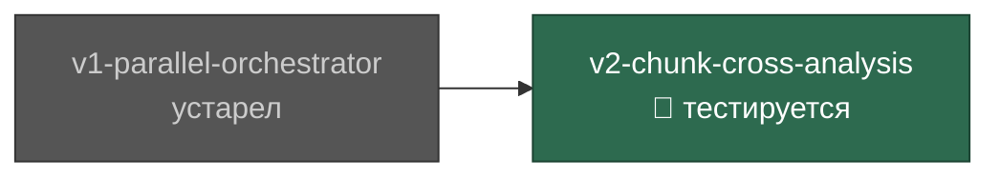

## Оглавление

- 📍 [v2-chunk-cross-analysis](#v2-chunk-cross-analysis) — тестируется | 2026-03-16
- [v1-parallel-orchestrator](#v1-parallel-orchestrator) — устарел | 2026-03-15

---

## Дерево версий

`main` ← `v2-chunk-cross-analysis` ← `v1-parallel-orchestrator`

---

# v2-chunk-cross-analysis ← ТЕКУЩАЯ

**Статус:** `тестируется`
**Родитель:** [v1-parallel-orchestrator](#v1-parallel-orchestrator)
**Ветка:** `main`
**Дата:** 2026-03-16

## Изменения

- Цель: переосмысление роли чанков — от независимого анализа к кросс-чанковому сравнению
- Субагенты должны искать тренды и аномалии в сравнении между чанками, а не только внутри одного
- Исправление P7: явная инструкция по сопоставлению данных из разных временных срезов

## Прогоны

| # | Модель | Проект | N | Результат | Команд | Примечания |
|---|--------|--------|---|-----------|--------|------------|
| — | — | — | — | — | — | — |

## Проблемы

| ID | Run# | Модель | Описание | Статус |
|----|------|--------|----------|--------|
| — | — | — | — | — |

## Решение по слиянию

- [ ] В процессе тестирования

---

# v1-parallel-orchestrator

**Статус:** `устарел`
**Родитель:** нет (первая версия)
**Ветка:** `main`
**Дата:** 2026-03-15

## Изменения

- Первая документированная версия скила
- ✅ Основной агент больше не читает логи (было 500+ tool executions)
- ✅ Субагенты не лезут в лишние tool executions
- ✅ Отчёт собирается корректно из ответов субагентов

## Прогоны

| # | Модель | Проект | N | Результат | Команд | Примечания |
|---|--------|--------|---|-----------|--------|------------|
| 1 | haiku (built-in) | Проект A | — | ✅ УСПЕХ | 60 | Агент не трогал логи; субагенты без лишних инструментов; отчёт честный |
| 2 | minimax (official) | Проект A | 5 | ❌ ПРОВАЛ | 500+ | Агент использовал основной агент вместо параллельных субагентов; не следовал инструкциям |
| 2 | minimax (official) | Проект B | 5 | ❌ ПРОВАЛ | 200+ | Агент использовал основной агент вместо параллельных субагентов; не следовал инструкциям |
| 3 | haiku (official api) | Проект B | — | ✅ УСПЕХ | <50 | Строгое выполнение инструкций; только anthropic models совместимы с claude code |
| 4 | codex | Проект B | — | ❌ ПРОВАЛ | — | Не понимает структуру скила |
| 5 | copilot | Проект B | — | ⚠️ ЧАСТИЧНО | — | Запустил субагенты, но не смог нормально разрезать логи (~5k строк за 10 минут) |
| 6 | copilot-sonnet-4.6 | Проект B | — | ✅ УСПЕХ | — | Успешно выполнил полный флоу анализа логов |
| 7 | copilot-sonnet-4.6 | Проект A | 10 | ⚠️ ЧАСТИЧНО | — | Субагенты запущены параллельно, но чанки заполнены лишь на ~30% (1840 из ~7350 потенциальных строк) |

## Проблемы

| ID | Run# | Модель | Описание | Статус |
|----|------|--------|----------|--------|
| P1 | 2 | minimax | Основной агент читал лог-файл напрямую вместо координации параллельных субагентов | 🔴 открыта |
| P2 | 4 | codex | Модель не понимает структуру скила и не может спланировать параллельную работу | 🔴 открыта |
| P3 | 5 | copilot | Не удалось корректно разрезать лог-файл на подлог файлы (низкая пропускная способность обработки) | 🔴 открыта |
| P4 | 4, 5 | codex, copilot | Сторонние модели не могут самостоятельно определить количество чанков и найти лог-файл; требуют явное указание в аргументах | 🔴 открыта |
| P5 | 7 | copilot-sonnet-4.6 | `TARGET_CHUNK_BYTES = 500_000` слишком мал для плотных JSON-логов (~272 байт/строку): каждый субагент получает ~1840 строк вместо ~7350, покрытие файла ~2.8% при N=10 | 🔴 открыта |
| P6 | 7 | copilot-sonnet-4.6 | Субагенты используют десятки вызовов инструментов вместо разрешённых 2 (прямое нарушение бюджета tool executions) | 🔴 открыта |
| P7 | — | — | Ключевая идея чанков (сравнение одинаковых данных из разных чанков, поиск трендов и аномалий по временным срезам) слабо отражена в промпте скила — субагенты не знают, что должны сопоставлять чанки между собой | 🔴 открыта |

## Решение по слиянию

- [x] Завершена — заменена версией v2-chunk-cross-analysis
