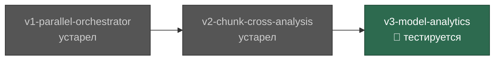

## Оглавление

- 📍 [v3-model-analytics](#v3-model-analytics) — тестируется | 2026-03-16
- [v2-chunk-cross-analysis](#v2-chunk-cross-analysis) — устарел | 2026-03-16
- [v1-parallel-orchestrator](#v1-parallel-orchestrator) — устарел | 2026-03-15

---

## Дерево версий

`main` ← `v3-model-analytics` ← `v2-chunk-cross-analysis` ← `v1-parallel-orchestrator`

---

# v3-model-analytics ← ТЕКУЩАЯ

**Статус:** `тестируется`
**Родитель:** [v2-chunk-cross-analysis](#v2-chunk-cross-analysis)
**Ветка:** `v3-model-analytics`
**Дата:** 2026-03-16

## Изменения

- Исправление P8: `== CROSS-CHUNK ROLE ==` перемещён **перед** `== PROJECT CONTEXT ==` — модель теперь читает роль до начала анализа
- Встроен обязательный формат счётчиков в каждый пункт `== ANALYSIS CHECKLIST ==`: `Pattern | N× | first_ts → last_ts`
- Добавлен `== OUTPUT COMPLETENESS CHECK ==` с чекбоксами вместо comment-style `### Cross-Chunk Signals` — блокирующая проверка перед отправкой ответа
- Добавлен fallback в Phase 4 Step 3: если субагент не вернул `### Cross-Chunk Signals` — оркестратор явно помечает чанк как `⚠️ метрики недоступны` вместо молчаливого пропуска

## Прогоны

| # | Модель | Проект | N | Результат | Команд | Примечания |
|---|--------|--------|---|-----------|--------|------------|
| 1 | sonnet | Проект A | — | ✅ УСПЕХ | 50 | идеально отработал согласно инструкции |
| 2 | copilot-sonnet-4.6 | Проект B | — | ✅ УСПЕХ | 100 | результат почти идеальный; пара вызовов внутри нескольких субагентов |
| 3 | copilot-gpt-5-mini | Проект A | — | ⚠️ ЧАСТИЧНО | 70 | проблема с нарезкой логов на чанки; чанки получились очень маленькие |
| 4 | haiku | Проект B | — | ✅ УСПЕХ | 40 | идеально отработал |

## Проблемы

| ID | Run# | Модель | Описание | Статус |
|----|------|--------|----------|--------|
| P10 | 3 | copilot-gpt-5-mini | Чанки при нарезке логов получились очень маленькие — модель не применила логику TARGET_CHUNK_BYTES корректно | 🔴 открыта |

## Исправленные проблемы

| P-ID | Описание | Исправлено в Run# |
|------|----------|-------------------|
| — | — | — |

## Решение по слиянию

- [ ] В процессе тестирования

---

# v2-chunk-cross-analysis

**Статус:** `устарел`
**Родитель:** [v1-parallel-orchestrator](#v1-parallel-orchestrator)
**Ветка:** `v2-chunk-cross-analysis`
**Дата:** 2026-03-16

## Изменения

- Исправление P7: переосмысление роли чанков — от независимого анализа к кросс-чанковому сравнению
- Добавлена секция `== CROSS-CHUNK ROLE ==` в промпт субагента: субагент теперь знает, что он часть временного ряда, и обязан квантифицировать каждую находку (счётчики, временные диапазоны)
- Добавлена секция `### Cross-Chunk Signals` в OUTPUT FORMAT субагента: структурированные числовые метрики для построения timeline оркестратором
- Усилен Phase 4 Step 3: явная инструкция — извлечь Cross-Chunk Signals из всех субагентов, построить таблицу метрик по чанкам, определить направление тренда (↑/↓/→/⚡)
- Добавлена секция `## Тренды по метрикам` в финальный шаблон отчёта

## Прогоны

| # | Модель | Проект | N | Результат | Команд | Примечания |
|---|--------|--------|---|-----------|--------|------------|
| 8 | copilot-gpt-5-mini | Проект A | 5 | ✅ УСПЕХ | 42 | Полный успех; тренды и Cross-Chunk Signals сработали корректно |
| 9 | haiku | Проект A | 5 | ⚠️ ЧАСТИЧНО | 55 | Отчёт содержателен, но без таблицы трендов и Cross-Chunk Signals — выглядит как v1-формат |
| 10 | haiku | Проект B | 5 | ⚠️ ЧАСТИЧНО | 50 | Та же проблема: нет таблицы трендов и Cross-Chunk Signals в отчёте |
| 11 | copilot-grok-code-fast-1 | Проект B | 5 | ⚠️ ЧАСТИЧНО | 50 | Тренды и формат v2 работают; но ~580 строк на чанк из 28k — покрытие ~10%, чанки слишком маленькие |

## Проблемы

| ID | Run# | Модель | Описание | Статус |
|----|------|--------|----------|--------|
| P8 | 9, 10 | haiku | Итоговый отчёт не содержит таблицы `## Тренды по метрикам` и секций `Cross-Chunk Signals` — субагенты не включили структурированные метрики, оркестратор не построил timeline | 🔴 открыта |
| P9 | 11 | copilot-grok-code-fast-1 | Чанки слишком малы (~580 строк при файле 28k строк): `LINES_PER_CHUNK` ограничивается `floor(TOTAL_LINES / N)` вместо расчёта по байтам — модель не применила логику TARGET_CHUNK_BYTES корректно | 🔴 открыта |

## Исправленные проблемы

| P-ID | Описание | Исправлено в Run# |
|------|----------|-------------------|
| P7 | Ключевая идея чанков слабо отражена в скиле — добавлены Cross-Chunk Role, Cross-Chunk Signals, таблица трендов | Run#8 |

## Решение по слиянию

- [x] Завершена — заменена версией v3-model-analytics

---

# v1-parallel-orchestrator

**Статус:** `устарел`
**Родитель:** нет (первая версия)
**Ветка:** `main`
**Дата:** 2026-03-15

## Изменения

- Первая документированная версия скила
- ✅ Основной агент больше не читает логи (было 500+ tool executions)
- ✅ Субагенты не лезут в лишние tool executions
- ✅ Отчёт собирается корректно из ответов субагентов

## Прогоны

| # | Модель | Проект | N | Результат | Команд | Примечания |
|---|--------|--------|---|-----------|--------|------------|
| 1 | haiku (built-in) | Проект A | — | ✅ УСПЕХ | 60 | Агент не трогал логи; субагенты без лишних инструментов; отчёт честный |
| 2 | minimax (official) | Проект A | 5 | ❌ ПРОВАЛ | 500+ | Агент использовал основной агент вместо параллельных субагентов; не следовал инструкциям |
| 2 | minimax (official) | Проект B | 5 | ❌ ПРОВАЛ | 200+ | Агент использовал основной агент вместо параллельных субагентов; не следовал инструкциям |
| 3 | haiku (official api) | Проект B | — | ✅ УСПЕХ | <50 | Строгое выполнение инструкций; только anthropic models совместимы с claude code |
| 4 | codex | Проект B | — | ❌ ПРОВАЛ | — | Не понимает структуру скила |
| 5 | copilot | Проект B | — | ⚠️ ЧАСТИЧНО | — | Запустил субагенты, но не смог нормально разрезать логи (~5k строк за 10 минут) |
| 6 | copilot-sonnet-4.6 | Проект B | — | ✅ УСПЕХ | — | Успешно выполнил полный флоу анализа логов |
| 7 | copilot-sonnet-4.6 | Проект A | 10 | ⚠️ ЧАСТИЧНО | — | Субагенты запущены параллельно, но чанки заполнены лишь на ~30% (1840 из ~7350 потенциальных строк) |

## Проблемы

| ID | Run# | Модель | Описание | Статус |
|----|------|--------|----------|--------|
| P1 | 2 | minimax | Основной агент читал лог-файл напрямую вместо координации параллельных субагентов | 🔴 открыта |
| P2 | 4 | codex | Модель не понимает структуру скила и не может спланировать параллельную работу | 🔴 открыта |
| P3 | 5 | copilot | Не удалось корректно разрезать лог-файл на подлог файлы (низкая пропускная способность обработки) | 🔴 открыта |
| P4 | 4, 5 | codex, copilot | Сторонние модели не могут самостоятельно определить количество чанков и найти лог-файл; требуют явное указание в аргументах | 🔴 открыта |
| P5 | 7 | copilot-sonnet-4.6 | `TARGET_CHUNK_BYTES = 500_000` слишком мал для плотных JSON-логов (~272 байт/строку): каждый субагент получает ~1840 строк вместо ~7350, покрытие файла ~2.8% при N=10 | 🔴 открыта |
| P6 | 7 | copilot-sonnet-4.6 | Субагенты используют десятки вызовов инструментов вместо разрешённых 2 (прямое нарушение бюджета tool executions) | 🔴 открыта |
| P7 | — | — | Ключевая идея чанков (сравнение одинаковых данных из разных чанков, поиск трендов и аномалий по временным срезам) слабо отражена в промпте скила — субагенты не знают, что должны сопоставлять чанки между собой | 🔴 открыта |

## Исправленные проблемы

| P-ID | Описание | Исправлено в Run# |
|------|----------|-------------------|
| — | — | — |

## Решение по слиянию

- [x] Завершена — заменена версией v2-chunk-cross-analysis
